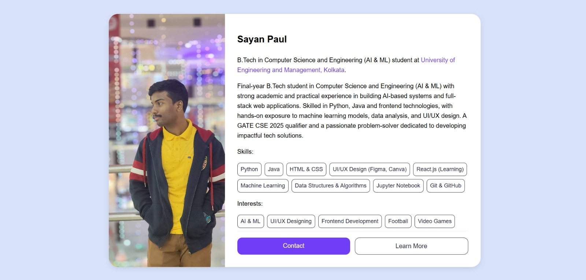

# 💼 Profile Card Web Project

A responsive and elegant **Profile Card** built using HTML and CSS. Showcases a brief personal summary, key skills, interests, and contact options — all inside a visually engaging and modern layout. Designed for portfolio pages, tech resumes, or GitHub Pages.

---

## 🔍 Preview

 

---

## 🧠 Features

- Fully responsive design
- Smooth hover effects and transitions
- Organized skill & interest tags using interactive chip UI
- Contact and navigation buttons
- Clean, semantic HTML5 + modular CSS variables

---

## 📌 Technologies Used

- **HTML5**
- **CSS3**
- **Responsive Flexbox Layout**
- **Custom CSS Variables**
- **Minimal External Dependencies**

---

## 📂 Folder Structure

index.html // Main file
style.css // All styles defined here
img.jpeg // Profile image
image.jpeg // Preview of this site


---

## 👤 Author

**Sayan Paul**  
B.Tech in CSE (AI & ML)  
[LinkedIn](https://www.linkedin.com/in/sayan-paul-51b725207/) | [GitHub](https://github.com/SayanCodemaster) | 📧 paulsayan980@gmail.com

---

## 💡 Use Case Ideas

- Developer portfolio front pages
- GitHub Pages personal landing card
- Mini-resume visualizer
- Resume/CV link anchor

---

## 📥 How to Use

1. Clone the repository:
```bash
git clone https://github.com/SayanCodemaster/Profile-Card.git
